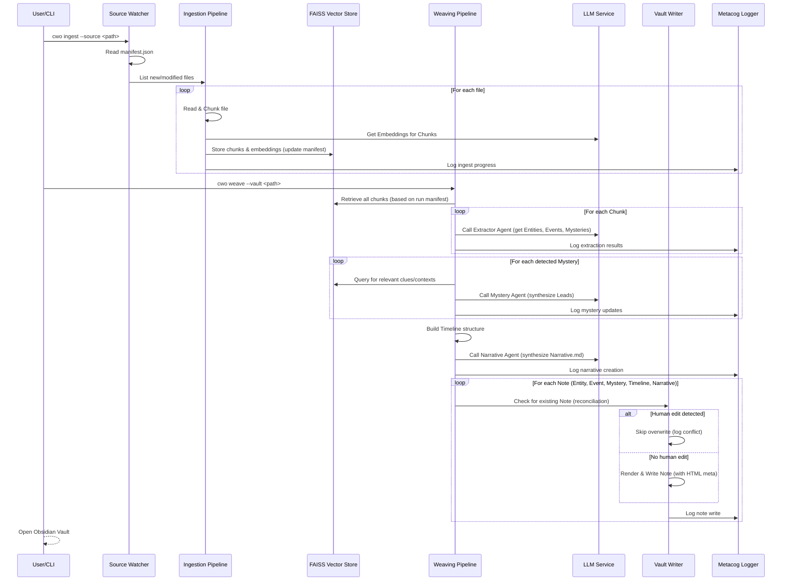

Alright, this is the definitive technical blueprint, combining the strategic "why" and "what" with the tactical "how" and "how to build it." This document is designed to be the foundational README for the GitHub repository, the onboarding guide for contributors, and the continuous reference for all technical decisions.

It's comprehensive, opinionated, and ready to get us coding.

---

# **Corpus Weaver for Obsidian (CWO) - Technical Design Document v0.2**

**Document Status: DRAFT v0.2** – *Last Updated: 2024-09-15. Expected to stabilize by 2025-07-01.*

---

## **0. North-Star Vision**

> CWO is an open-source, self-documenting agent pipeline that ingests any pile of files and emits an Obsidian vault whose Markdown notes tell the story of the corpus, track unanswered questions, and expose the agent’s own reasoning—so researchers spend time thinking, not filing.

---

## **1. The Problem of Knowledge: From Digital Landfill to Living Garden**

### **1.1. Introduction: The Unfulfilled Promise of the Information Age**

We live in an era of unprecedented access to information. With a few clicks, we can download gigabytes of academic papers, historical archives, legal documents, project files, and market research. This digital abundance holds a powerful promise: that with enough data, we can uncover hidden patterns, build comprehensive arguments, and make better-informed decisions.

Yet for most researchers, academics, journalists, analysts, and lifelong learners, this promise remains largely unfulfilled. The reality is not an enlightened library but a sprawling, chaotic digital landfill. Our hard drives are graveyards of PDFs we intended to read, our project folders are tangled messes of Word documents and meeting notes, and our "read-it-later" queues are infinite.

The core problem is this: **Data is not knowledge.** Raw information, no matter the volume, is inert. It lacks context, connection, and narrative. True understanding emerges only when we can structure this raw material, see the relationships between disparate facts, understand its evolution over time, and critically, identify what is *missing*.

Corpus Weaver for Obsidian (CWO) is born from a deep analysis of this fundamental disconnect. It is an attempt to build the missing bridge between the chaotic reality of our digital archives and the structured, interconnected, and narrative-driven understanding our minds require.

### **1.2. The Plight of the Modern Researcher: The Inert Archive**

Consider a historian researching a specific political scandal from the 1980s, working with hundreds of scanned newspaper articles, declassified memos, biographies, and interview transcripts. Their current workflow is a brutal exercise in manual labor and flawed memory. `Ctrl+F` is a blunt instrument, finding keywords, not concepts. Manual note extraction is slow and lossy, missing subtle connections. The archive remains fundamentally *inert*—a passive repository that yields insights only in proportion to heroic human effort.

### **1.3. The Two Flawed Paradigms of Knowledge Management**

To solve this, two paradigms have emerged, both powerful, both incomplete:

*   **Paradigm A: The Manual Artisan (The PKM Tool)**
    *   **Examples:** Obsidian, Roam Research, Logseq.
    *   **Pros:** Flexible, transparent, fosters emergent structure, human-centric.
    *   **Cons:** **The Tyranny of the Blank Canvas.** Requires immense manual effort for ingestion, atomization, and linking. Doesn't scale for large corpora. Biased by human memory and attention.
*   **Paradigm B: The Opaque Oracle (The AI Database)**
    *   **Examples:** Vector stores with LLM query layers.
    *   **Pros:** Powerful for answering direct questions, handles massive scale, finds hidden patterns.
    *   **Cons:** **The Opaque Black Box.** Lacks browsability, prevents serendipitous discovery. No audit trail for LLM reasoning, leading to a trust deficit. Destroys underlying structure in favor of a final answer.

### **1.4. The Three Core Gaps CWO Is Uniquely Designed to Solve**

CWO is a new synthesis designed to bridge the chasm between these paradigms by addressing three critical gaps:

1.  **The Narrative Gap: From a Bag of Facts to a Coherent Story**
    *   **Problem:** Human cognition is wired for narrative, but tools provide discrete facts.
    *   **CWO's Solution: Narrative-First Generation.** CWO structures the corpus as a story, organizing `Nuggets` chronologically into hierarchical `_Timelines/` (Year/Month notes) and synthesizing an overarching `Narrative.md`.

2.  **The Epistemic Gap: From Finding Answers to Formulating Questions**
    *   **Problem:** Tools find what *is* in the corpus, but not what is *missing* or *unresolved*.
    *   **CWO's Solution: The Mystery Workflow.** CWO actively identifies statements of uncertainty, elevating them into first-class `Mystery` notes. These are active research prompts, with the agent performing "investigation passes" on subsequent runs to find new clues.

3.  **The Trust Gap: From an Opaque Process to Metacognitive Transparency**
    *   **Problem:** AI's "black box" nature hinders trust and validation.
    *   **CWO's Solution: The Metacognitive `_Meta/` Folder.** CWO explains *itself*. It generates its own documentation (architecture, prompt versions, decision logs) in `_Meta/`, creating a "glass box" for full auditability and transparency.

### **1.5. Conclusion: A New Synthesis**

CWO combines the **power of AI** with the **transparency and structure of a PKM tool**, while introducing **narrative intelligence**, embracing **epistemic humility**, and establishing **unprecedented trust** through self-documentation. It aims to transform raw documents into a living, self-aware knowledge garden that learns, reflects, and grows alongside its human cultivator.

---

## **2. Core Design Principles → Implementation Heuristics**

These principles guide every technical decision and design choice.

| Manifest Principle        | Heuristic in Code / UX                                                                                                    |
| :------------------------ | :------------------------------------------------------------------------------------------------------------------------ |
| **Narrative-first**       | Every extraction cycle culminates in a regenerated `Narrative.md` and a refreshed `_Timelines/YYYY/MM.md` tree. Think “chronology is a write barrier.” |
| **Epistemic humility**    | Run a “gap-scanner” pass that elevates sentences with modal uncertainty (“unknown,” “unclear,” “needs investigation”) into `Mystery/{ID}.md`; each gets re-queried every ingest cycle until resolved. |
| **Radical transparency**  | Write a JSONL metacog log (`_Meta/log.jsonl`) with `{timestamp, step, decision, rationale}` objects, and a machine-readable “prompt manifest” for reproducibility. |
| **Human-override friendly**| Every autogenerated note tops with an invisible HTML comment block (`<!-- CWO:... -->`) containing hashes of its generated content. On subsequent runs, if content hash mismatch, CWO logs the conflict and skips overwriting (MVP). |
| **Incremental at scale**  | Treat new/changed files as a delta feed; chunk & vector-embed only the diff, keeping IDs stable for backlinks.             |
| **Zero-infrastructure**   | All components run in a single Python process, persist to ordinary files, and require no Docker or background services.   |

---

## **3. System Architecture & Requirements**

### **3.1. Technical Goals & Non-Goals**

*   **Technical Goals:**
    *   Build a pure-Python, single-process pipeline with no external service dependencies (e.g., Docker, databases).
    *   Prioritize a simple, file-based persistence model that can be easily backed up, inspected, and deleted.
    *   Ensure all core logic is abstracted from the specific LLM and vector store implementations to allow for future flexibility.
    *   Produce a final Obsidian Vault that requires zero special plugins or configuration to be immediately useful.
*   **Technical Non-Goals:**
    *   Real-time, multi-user collaboration.
    *   A graphical user interface (GUI) for v0.1.
    *   Support for any database backends beyond file-based SQLite (for metadata) and FAISS (for vectors).
    *   An API for third-party extensions (post-v1.0).

### **3.2. Core Component Diagram (Single Process)**

```mermaid
graph TD
    A[PDF/TXT Source Files] --> B[LlamaIndex Readers & Chunker]
    B --> C[ServiceContext (Configured LLM, Embeddings)]
    C --> D[FAISSVectorStore (workspace/faiss.index)]
    D -- (query results) --> E[Extractor Agent (LLM Pass 1)]
    E --> F[Mystery Agent (LLM Pass 2 + Vector Query)]
    F --> G[Timeline Builder]
    G --> H[Narrative Agent (LLM Pass 3)]
    H --> I[Vault Writer (Markdown Notes)]
    I --> J[Metacog Logger (workspace/vault/_Meta/log.jsonl)]
    I -- (user edits) --> K[Obsidian Vault]
```

**Key Choices:**
*   **Language:** Python 3.12+ (rich ecosystem, excellent for ML/LLM tooling).
*   **LLM Driver:** Remote LLMs (e.g., Gemini). No local NLP libraries like NLTK or embedding models are used at this stage.
*   **Vector Store:** Currently mocked in memory. The plan is to introduce FAISS or a similar store once the core workflow is validated.
*   **Persistence:** All artifacts live inside a single `~/cwo_workspace/` folder.
*   **Orchestration:** Implicitly managed within the Python process; no explicit task runner like Prefect/Dagster for PoC/MVP.

### **3.3. Sequence Diagram (Full Ingest + Weave Pass)**



### **3.4. Non-Functional Requirements (NFRs)**

*   **Ingestion Throughput:** ≥ 1 MiB of raw text processed (chunked, embedded, indexed) per second on a standard quad-core laptop with an SSD.
*   **Weaving Latency:** A "small" 100-document (avg. 5 pages) corpus should complete a full `weave` pass in under 5 minutes.
*   **Memory Ceiling:** The entire Python process must not exceed 4 GiB of RAM during any stage for a small corpus.
*   **Disk Footprint:** The `workspace` should be roughly: `(Size of Raw Corpus) + (Size of FAISS Index ≈ 1.5 * #Chunks * 768 * 4 bytes) + (Size of Vault)`.
*   **Data Privacy:** No part of the source corpus text or its derivatives will be sent over the network unless there is an embedding cache miss or a direct LLM analysis call is required. All network calls must be explicitly enabled by the user providing an API key.

### **3.5. Configuration & Extensibility:**

| Parameter | Env Var | Default | Description |
| :--- | :--- | :--- | :--- |
| Vector Store Backend | `CWO_VECTOR_BACKEND` | `milvus` | `milvus` or `faiss`. Dictates the underlying vector database. |
| LLM Provider & Model | `CWO_LLM_MODEL` | `gemini-1.5-pro` | Name of the LLM used for extraction and synthesis tasks. |
| Embedding Model | `CWO_EMBED_MODEL` | `BAAI/bge-base-en-v1.5` | HuggingFace name for the embedding model. |
| Chunk Size | `CWO_CHUNK_SIZE` | `1024` | Max token count for each text chunk. |
| Chunk Overlap | `CWO_CHUNK_OVERLAP` | `128` | Overlap in tokens between consecutive chunks. |
*   **Extension Points:** Core components (Readers, Chunkers, Embedders, Vector Stores) will be designed for simple subclassing. A `cwo/plugins.py` file will define the base classes, allowing for community contributions to add support for new file types, LLMs, or vector stores.

---

## **4. Data Models & Schemas**

This section defines the "shape" of data flowing through and persisted by the system. All in-memory structures will primarily use Pydantic models for validation and serialization.

### **4.1. On-Disk Structure:**

The entire CWO workspace resides in a single, user-specified directory, e.g., `~/cwo_workspace/`. This makes it portable and easily manageable.

```
cwo_workspace/
├── manifest.json         # Records SHA256 hashes of processed source files, their doc_ids, and last modified timestamps.
├── faiss.index           # The FAISS vector store file.
└── vault/                # The final Obsidian vault output.
    ├── 00_Notes/         # Individual Nugget notes (Entities, Events).
    ├── _Timelines/       # Hierarchical year/month notes (YYYY.md, YYYY-MM.md).
    ├── _Mysteries/       # Notes for unresolved questions.
    ├── _Resolutions/     # (Future) User-created notes to resolve Mysteries.
    └── _Meta/            # Agent's self-documentation.
        └── log.jsonl     # Structured JSONL log of agent's decisions and operations.
        └── Architecture.md # High-level design notes by the agent itself.
        └── Prompts.md    # History of prompts used per run.
```

### **4.2. Core Data Schemas (Pydantic Models):**

All Pydantic models will include a `schema_version` field to facilitate future migrations.

```python
from pydantic import BaseModel, Field
from typing import Literal, Optional, List

class DocumentMetadata(BaseModel):
    file_path: str
    file_hash: str
    last_modified: str # ISO format
    doc_id: str # SHA256 of file_path + file_hash

class Chunk(BaseModel):
    id: str = Field(description="Unique ID: doc_hash-chunk_seq_id")
    document_id: str
    text: str
    metadata: dict = Field(default_factory=dict, description="e.g., {'page': 5, 'start_char': 100}")

class EntityV1(BaseModel):
    schema_version: Literal[1] = 1
    id: str = Field(description="Unique entity ID, e.g., 'person-dr-eva-rojas'")
    label: str = Field(description="The primary name of the entity")
    type: Literal["PERSON", "ORGANIZATION", "PROJECT", "LOCATION", "ARTIFACT", "CONCEPT"]
    aliases: List[str] = Field(default_factory=list, description="Other names/phrases for this entity")
    summary: Optional[str] = Field(None, description="A brief description of the entity")

class EventV1(BaseModel):
    schema_version: Literal[1] = 1
    id: str = Field(description="Unique event ID, e.g., 'evt-2023-10-05-001'")
    date: str = Field(description="The date of the event in YYYY-MM-DD format (00 for unknown month/day)")
    summary: str = Field(description="A concise, one-sentence summary of the event")
    participants: List[str] = Field(default_factory=list, description="List of Entity IDs involved")
    confidence: float = Field(description="LLM's confidence (0.0 to 1.0) in this event's accuracy")
    source_chunk_id: str = Field(description="ID of the chunk where this event was found")

class MysteryV1(BaseModel):
    schema_version: Literal[1] = 1
    id: str = Field(description="Unique mystery ID, e.g., 'myst-240915-001'")
    question: str = Field(description="The unresolved question formulated from the text")
    source_quote_snippet: str = Field(description="Exact quote from the text that identified this mystery")
    leads: List[str] = Field(default_factory=list, description="Summaries of findings from investigation passes")
    status: Literal["OPEN", "INVESTIGATING", "RESOLVED"] = "OPEN"
    initial_detection_chunk_id: str

class MetacogLogEntry(BaseModel):
    ts: str = Field(description="ISO formatted timestamp")
    lvl: Literal["INFO", "WARN", "ERROR", "DEBUG"]
    msg: str
    run_id: str
    ctx: dict = Field(default_factory=dict, description="Contextual data, e.g., {'chunk_id': '...', 'llm_tokens': 123}")
```

### **4.3. Markdown Note Metadata (HTML Comment):**

All CWO-generated Markdown notes will include a hidden HTML comment block at the top. This allows CWO to identify its own content and manage updates without clobbering user edits.

```html
<!-- CWO:_v1 {
  "id": "evt-2023-10-05-001",
  "type": "Event",
  "source_hash": "sha256-abc...",  /* Hash of the original content CWO used to generate this note */
  "content_hash": "sha256-xyz..."  /* Hash of the text content *above* this comment in the MD file */
} -->
```

---

## **5. Core Algorithms & Operational Concerns**

### **5.1. Incremental Ingestion Logic:**

This ensures CWO only processes what's new or changed.
1.  On `cwo ingest --source <path>`, the `Source Watcher` reads the `manifest.json` in the `cwo_workspace/` directory.
2.  It calculates the SHA256 hash for each file in the `<path>` and compares it against the `manifest`.
3.  **If** a file's hash is new or has changed:
    a.  If `doc_id` exists, all existing `Chunk` vectors associated with that `doc_id` are removed from FAISS.
    b.  The file is read, chunked, and new `Chunk` objects are created.
    c.  `Chunk` embeddings are generated and inserted into FAISS.
4.  `manifest.json` is updated with the new `doc_id` and hash.

### **5.2. Human-Override Reconciliation Logic:**

This implements the "Human-override friendly" principle.
1.  Before the `Vault Writer` attempts to write or overwrite an existing Markdown note in the `vault/` directory:
2.  It reads the existing file's content and attempts to parse the CWO HTML metadata comment.
3.  It calculates the hash of the text content *above* that comment in the existing file (`current_content_hash`).
4.  **If** `current_content_hash` equals the `content_hash` stored in the HTML metadata:
    a.  The user has *not* modified the CWO-generated text. The `Vault Writer` proceeds to overwrite the file with its new content and an updated metadata block.
5.  **Else** (`current_content_hash` does *not* equal `saved_content_hash`):
    a.  The user has edited the note. The `Vault Writer` will **not** overwrite the file in v0.1.
    b.  It logs a `reconciliation_conflict` entry in the `Metacog` log, noting the `note_id` and the detected change.
    c.  *[Future Enhancement (Post-MVP)]*: The `Vault Writer` will attempt a basic three-way merge or create a separate `NoteTitle (CWO Suggestion).md` file, indicating new information that the user can manually integrate.

### **5.3. Logging Hygiene:**

*   **Format:** All logs will be structured JSONL, written to `workspace/vault/_Meta/log.jsonl`.
*   **Fields:** Each log entry must include `ts` (ISO timestamp), `lvl` (level: INFO, WARN, ERROR, DEBUG), `msg` (human-readable message), `run_id` (UUID for current execution), and `ctx` (a dictionary for contextual data, e.g., `chunk_id`, `llm_tokens`, `file_path`).
*   **Policy:** A new `log.jsonl` file is created for each run. Old logs are not automatically rotated in v0.1 (user is responsible for managing).

### **5.4. Error Handling:**

*   **Fatal Errors (abort run):** Invalid configuration (e.g., missing API keys, invalid paths), critical failures during core process initialization (e.g., FAISS index load failure), or unhandled exceptions that indicate a fundamental code bug.
*   **Skippable Errors (log and continue):** Failures to parse a single source file (e.g., malformed PDF), LLM errors on a single chunk (e.g., bad JSON response, rate limit hit), or failure to write a single Markdown note due to permissions. These events will be logged at `WARN` or `ERROR` level, but the overall pipeline will attempt to complete.

### **5.5. Observability:**

*   A `--stats` flag will be added to the `cwo weave` command, printing a concise summary upon completion of a full run. This data is derived from the `Metacog` log.
    ```
    --- CWO Run Stats ---
    Run ID: [UUID]
    Total Runtime: 4m 32s
    Files Processed: 105 (2 new, 3 modified)
    Chunks Created: 2,450
    LLM Calls: 2,452 (2450 extraction, 2 narrative)
    Total Tokens (Input/Output): ~3.5M / ~0.8M
    Estimated API Cost: ~$1.75
    Notes Created: 150 Events, 12 Mysteries, 24 Timelines
    Human Overrides Detected: 5
    ```

### **5.6. Recovery & Resumability:**

*   The file-based `manifest.json` ensures that `cwo ingest` operations are resumable and idempotent: only new or changed files are processed.
*   The `cwo weave` process is designed to be idempotent: re-running it will regenerate the vault from the current state of the FAISS index. Existing notes will be re-written (unless a human override is detected), ensuring consistency.

---

## **6. Testing Strategy & CI**

A robust testing strategy is critical for a project like CWO, where the quality of output is paramount.

*   **Unit Tests:** Every individual module and function will have `pytest` unit tests, with external dependencies (LLMs, file system) properly mocked.
*   **Integration Tests:**
    *   A `tests/corpora` directory will contain small, representative sets of documents (e.g., `tiny_corpus_1`, `medium_corpus_alpha`).
    *   The CI pipeline will run the full `cwo ingest && cwo weave` command on these corpora.
    *   Key Scenarios:
        *   **`happy_path`:** Clean text files, verify basic note creation and linking.
        *   **`pdf_ocr`:** Mix of text-based and image-based PDFs, verify OCR handling.
        *   **`incremental_update`:** Simulate adding new files and modifying existing ones to verify correct incremental processing.
        *   **`human_override`:** Test detection of human edits and correct `reconciliation_conflict` logging.

*   **Continuous Integration (CI):**
    *   **Platform:** GitHub Actions, running on Windows, macOS, and Linux.
    *   **Checks:** `ruff` (linter/formatter), `mypy` (type checking), `pytest` (unit and integration tests).
    *   **Mock LLM:** CI runs will use a mock LLM service that returns pre-recorded, deterministic responses from fixture files (`tests/fixtures/llm_responses/`), preventing API calls and ensuring consistent test results.
    *   **Golden Vault Checksum:** For each integration test corpus, a "golden vault" manifest (`tests/golden/<corpus_name>/manifest.txt`) will be maintained. This manifest contains the SHA256 hash of every expected file in the output vault. Any hash mismatch during CI will fail the build, forcing a human review of unintended changes.
    *   **Performance Benchmark:** A scheduled weekly CI action will run `cwo ingest` and `cwo weave` on a standardized larger corpus. This benchmark will track `ingest` throughput and `weave` latency. The CI will fail if these metrics regress by more than 20% from the main branch baseline, alerting to performance regressions.

---

## **7. Security & Licensing**

### **7.1. Short Threat Model:**

The primary threat is the unintentional leakage or misuse of potentially sensitive information from the user's local source corpus. Since CWO processes local files, this is a significant concern.

*   **Mitigation:**
    *   **Local-First & Opt-In Network:** CWO operates entirely locally by default. No data leaves the machine unless the user explicitly configures and provides an API key for a remote LLM service (e.g., Google Gemini, OpenAI).
    *   **No Telemetry:** The application collects no telemetry data.
    *   **Key Storage:** API keys are stored securely via environment variables or system credential managers, not directly in source control or persistent files.
    *   **Log Redaction:** The `Metacog` log will, by default, redact or truncate text snippets from the source corpus when logging LLM interactions, unless a specific debug mode is enabled.

### **7.2. Licensing:**

*   **Project License:** CWO will be released under the **MIT License**, fostering open contribution and broad adoption.
*   **Dependency Compatibility:** All direct and transitive dependencies (`requirements.txt`) will be vetted to ensure their licenses are compatible with the MIT license. A `LICENSE-3RD-PARTY.txt` file will be generated and included in the distribution, listing all third-party dependencies and their respective licenses for transparency.

---

## **8. Roadmap to v1.0 & Open Issues**

This section outlines known limitations in the MVP and planned resolutions for future versions, ensuring alignment on strategic direction.

| Theme | MVP Compromise (v0.1) | v1.0 Resolution |
| :--- | :--- | :--- |
| **Prompt Management** | Single, hard-coded prompt string in Python modules. | Prompt templates loaded from versioned YAML files (e.g., from `_Meta/prompts/`); a dedicated prompt regression test suite. |
| **Large-Corpus Cost/Performance** | Simple local LLM call caching based on chunk hash. | A more sophisticated caching layer; support for advanced rate limiting for remote inference; deeper integration with local/quantized models (Ollama, LM Studio). |
| **Vector Store Capabilities** | FAISS used, requiring client-side filtering for complex metadata queries (e.g., searching Mysteries by detection date). | Default to a vector store with robust native metadata filtering (e.g., Milvus-lite, Qdrant) for more efficient Mystery investigations. |
| **Human Override Handling** | Conflicts are logged; CWO skips overwriting user-edited notes. | A basic three-way merge is attempted, inserting CWO's new findings as a distinct suggestion block within user-edited files. |
| **Agent Metacognition** | Basic decision logging in JSONL. | Agent generates structured `Architecture.md` and `Prompts.md` within `_Meta/` folder, summarizing its own design and prompt evolution. |
| **PDF Extraction Quality** | Relies on default `pymupdf` via LlamaIndex; no OCR correction. | Integration with advanced OCR libraries; user-configurable PDF parser backends. |

---

## **9. Immediate Next Steps (This Week)**

These are the immediate, actionable tasks to kickstart development.

1.  **Repository Initialization:** Create the GitHub repository (`corpus-weaver-obsidian`).
2.  **Initial Setup:**
    *   Add `.editorconfig` for consistent formatting.
    *   Create `requirements.txt` with pinned library versions (including `faiss-cpu` and `google-cloud-aiplatform`).
    *   Configure `ruff` and `mypy` in `pyproject.toml`.
3.  **CLI Skeleton:** Implement the basic `cwo` command structure using `click` or `argparse`, with `cwo init`, `cwo ingest`, and `cwo weave` placeholders.
4.  **Workspace Manager:** Implement `cwo init /path/to/workspace` to create the `cwo_workspace/` directory and its basic subfolders (`vault/`, etc.).
5.  **Source Watcher & Chunker:** Implement the `watcher.py` (file scanning & manifest logic) and `chunker.py` (LlamaIndex readers, chunking) components.
6.  **FAISS Wiring:** Get `FAISSVectorStore` initialized and successfully storing basic chunks and embeddings from a single test file.
7.  **CI Setup:** Configure GitHub Actions for initial linting (`ruff`, `mypy`) and basic `pytest` unit tests (without LLM calls).

---

This is it. This document is the foundation. It's ready for the GitHub repo.
